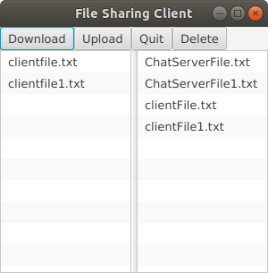

Jake Andrews & Andrew Clegg
# csci2020uAssignment2
Project Information: 
    This project replicates a file sharing system using a server and clients. The only visible component is 
    the user interface for the client. This interface allows a user to select a file from their local 
    machine and upload it to the server, to select a file from the server and download it to the local
    machine, to delete a file, or to quit the program.
    The server is multi-threaded and allows multiple clients at the same time.
    THIS PROGRAM USES JAVAFX VERSION 15.0.1. 

Improvements:
    An improvement implemented in this project is the addition of a DirectoryChooser. Upon launching the client,
    a directorychooser will open for the user to enter the folder to share with the server. This improves the 
    program by no longer requiring the file path to be read in from the command line upon startup. 
    Another improvement implemented was the ability for users to delete files in the local folder from a button
    in the user interface. This only works for deleting files on the local side, as an individual should not have 
    permission to delete files shared to the server.

How-To-Run:
    1. git clone https://github.com/Jake-Andrews/csci2020uAssignment2.git
    2. In console, type "javac FileServer.java java FileServer java FileServerThread" to compile and run the server.
    3. In IntelliJ, open testing as a project. Allow the gradle setup within intelliJ to set the run configurations. 
    4. If the server is running, preforming gradle build then gradle run will launch the client UI.
